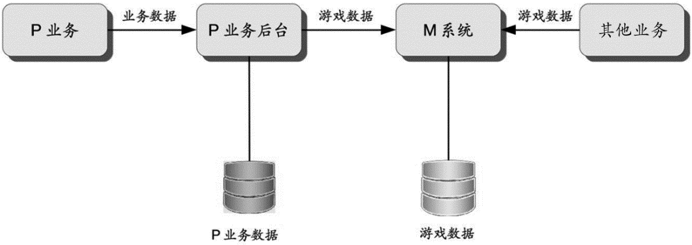
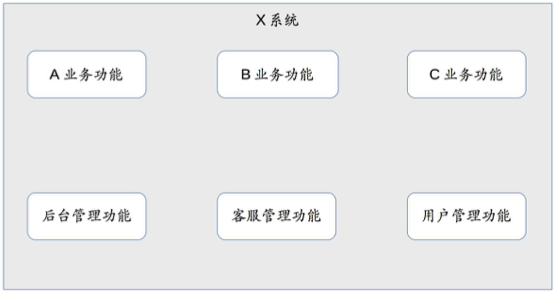

# 44-架构重构内功心法第一式：有的放矢

一般情况下，系统的架构是不断演化的，少部分架构演化可能需要推倒重来进行重定，但大部分的架构演化都是通过架构重构来实现的。相比全新的系统架构设计，架构重构要求更高：
- 业务已经上线，无法停下来
  
- 关联方众多，牵一发动全身
  
  架构重构涉及业务关联方很多，不同关联方的资源投入程度、业务发展速度、对架构痛点的敏感程度等有很大的差异,如何尽量减少关联方的影响，或者协调关联方统一行动，是一个很大的挑战。

- 旧架构的约束
  
  架构重构需要在旧的架构上进行，这是一个很强的约束，会限制架构师的技术范围。而如果是新的架构，则选择的范围就很大。

  即使是决定推倒重来，完全抛弃旧的架构而去设计新的架构，新的架构也会受到旧架构的影响。因为，业务在旧的架构上产生的数据不能推到重来，新的架构必须考虑如何将旧的架构产生的数据转换过来。

因此,架构重构对架构师的要求很高，业务上要求架构师能够说服产品经理暂缓或暂停业务进行架构重构。团队上要求与其它团队达成一致的架构重构计划和步骤。技术上要求架构师给出让技术团队认可的架构方案。

当系统架构不满足业务发展时，其表现形式是系统不断出各种问题，轻微一点的是系统响应慢、数据出错、某些用户访问失败等,严重的可能是系统宕机、数据库瘫痪、数据丢失等,或者系统的开发效率低。开始的时候，可能是针对具体问题去解决、解决一个算一个。如果时间长了以后也不见好转，那么可能就会想到是否是架构出了问题，讨论是否是因为架构导致各种问题。一旦确认需要架构重构,就会由架构师进行牵头进行架构重构的分析。

当架构师进行架构重构分析时，会发现到处都是问题，每个问题都需要解决。如果要解决所有的问题，架构重构其实也是无能为力的。

期望通过架构重构解决所有问题是不现实的，所以架构师的首要任务是从一推问题中识别出真正要通过架构重构来解决的问题，集中力量快速解决，而不是想着通过架构重构解决所有的问题。否则会陷入人少事多的处境，团队累死累活的忙了很久，发现好像什么都做了，但是问题依然存在。

下面几个是虚拟的例子。

1. 后台系统重构：解决不合理的耦合
   
M系统是一个后台管理系统，负责管理所有的游戏相关数据，重构的主要原因是因为系统耦合了P业务独有的数据和所有业务公用的数据，导致可扩展性差。

针对M系统存在的问题，重构目标就是将游戏数据和业务数据拆开，解开二者的耦合，使得二个系统能够独立的发展。

2. 游戏接入系统重构：解决全局单点的可用性问题

S系统是游戏接入的核心系统，一旦核心系统故障，大量游戏玩家就不能登入游戏。而S系统不具备多中心的能力，一旦主机房宕机，整个S系统的业务就不可用了。从图可以看出，数据库主库是全局单点，一旦数据库主库不可用，二个集群的写业务不可用。

针对S系统出现的问题，重构目标是实现双中心，使得任意一个机房都能够提供完整的服务,在某个机房出现故障时，另外一个机房能够全部接管所有业务。

3. X系统：解决大系统带来的开发效率问题

X系统是创新业务的主系统,之前在快速尝试和发展期间，怎么方便就怎么操作，怎么快速就怎么做，系统设计并未投入太多的精力和时间，很多东西都是放在同一个系统里面的。

从很多问题中找到重构的目标,并不是一目了然的。而如果想一下解决所有的问题,人力和时间是不够的。所以架构师要透过现象看本质,找出真正需要通过架构重构来解决的核心问题，从而做到有的放矢，即不会耗费大量的人力和时间投入，又能够解决核心问题。即不能看到问题就想架构重构，也不能只是针对问题进行系统优化，判断到底是采用架构重构还是系统优化,可以采用以下一个简单的做法：**假设我们从0开始设计当前系统，新架构和老架构是否类似，如果差异不大，说明采用系统优化即可，如果差异很大，则可能需要架构重构了**。

对于非架构重构问题，可以在架构重构成功后，启动多个优化的项目去优化这些问题，此时的优化问题主要由团队内部完成，与其它团队无关，优化速度会很快。如果没有架构重构就优化的话，则每次优化都要拉一大推业务相关的团队来讨论方案，效率很低。

