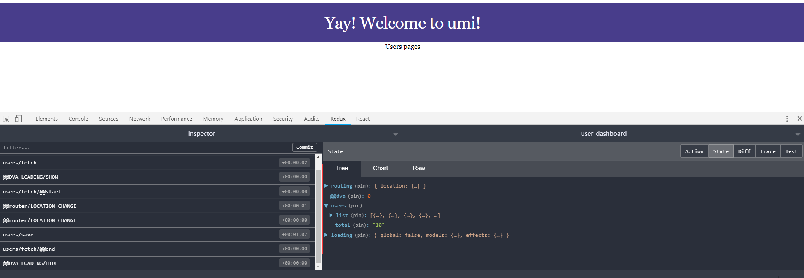
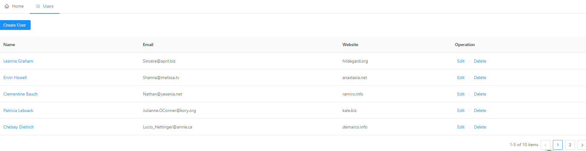

# 使用umi完成用户管理的crud

## 1.安装yarn和tyarn
```bash
# 国内源
$ npm i yarn tyarn -g
# 后面文档里的 yarn 换成 tyarn
$ tyarn -v
```

## 2.脚手架创建应用

``` bash
mkdir user-dashboard
cd user-dashboard
tyarn create umi
```
选择project->dva,安装依赖，启动
```
tyarn 
tyarn start
```

打开浏览器访问:http://localhost:8000,显示下列页面则表示成功。


## 3.生成users路由

umi中文件即路由，所以要新增路由，只要创建文件即可。

创建src/pages/users/index.js文件
```javascript
export default ()=> {
    return (
        <div>Users pages</div>
    )
}
```
访问:http://localhost:8000/users,能够正常访问则表示成功。


## 4.umi整合dva
由于使用脚手架创建项目时，已经选择了dva,所以可以不用安装dva。
修改配置文件.umirc.js文件，开启dva。
```javascript
export default {
  plugins: [
    [
      'umi-plugin-react',
      {
        dva: {
          immer: true
        }
      }
    ],
  ],
};
```

## 5.配置代理
修改.umirc.js文件,增加代理配置
```javascript
"proxy": {
    "/api": {
      "target": "http://jsonplaceholder.typicode.com/",
      "changeOrigin": true,
      "pathRewrite": { "^/api" : "" }
    }
  }
```
此时访问http://localhost:8000/api/users，可显示用户列表数据。

## 6.构造users model和service
model分为二种，一种是全局model，一种是页面model。全局 model 存于 /src/models/ 目录，所有页面都可引用；页面 model 不能被其他页面所引用这里使用页面model。

新增src/pages/users/models/users.js,内容如下：
``` javascript
import * as usersService from '../services/users';
export default {
    namespaces: 'users', //命名空间
    state: { //状态数据
        list: [],
        total:0,
        page:1
    },
    reducers: { //处理同步请求，常用于计算state
        save(state,{payload:{data:list,total,page}}) { //save为effects中的put中的type
            if (isNaN(page)) {
                page = 1;
            }
            return {...state,list,total,page}
        }
    },
    effects: { //处理异步请求
        *fetch({ payload: { page } }, { call, put }) { //
          const { data, headers } = yield call(usersService.fetch, { page }); //执行异步的请求，等待返回值
          yield put({ type: 'save', payload: { data, total: headers['x-total-count'],page } }); 
        },
      },
    subscriptions: { //订阅器
        setup({ dispatch, history }) {
            return history.listen(({ pathname, query }) => { //监听Url
            if (pathname === '/users') {
                dispatch({ type: 'fetch', payload: query }); //payload:请求的参数
            }
            });
        }
    }
}
```

新增src/pages/users/services/users.js文件

```javascript
import request from '../../../utils/request';
export function fetch({ page = 1 }) {
    return request(`/api/users?_page=${page}&_limit=5`);
  }
```

新增src/utils/request.js文件
```javascript
import fetch from 'dva/fetch';

function checkStatus(response) {
  if (response.status >= 200 && response.status < 300) {
    return response;
  }

  const error = new Error(response.statusText);
  error.response = response;
  throw error;
}

/**
 * Requests a URL, returning a promise.
 *
 * @param  {string} url       The URL we want to request
 * @param  {object} [options] The options we want to pass to "fetch"
 * @return {object}           An object containing either "data" or "err"
 */
export default async function request(url, options) {
  const response = await fetch(url, options);

  checkStatus(response);

  const data = await response.json();

  const ret = {
    data,
    headers: {},
  };

  if (response.headers.get('x-total-count')) {
    ret.headers['x-total-count'] = response.headers.get('x-total-count');
  }

  return ret;
}
```

切换到浏览器，虽然页面仍然没有数据，但是打开redux开发工具，应该可以看到 users/fetch 和 users/save 的 action 以及相关的 state。



## 7.添加页面，显示用户列表

新建src/pages/users/components/Users.js文件：
``` javascript
import React,{Component} from 'react'
import { Table, Pagination, Popconfirm } from 'antd';
import { routerRedux } from 'dva/router';
import { connect } from 'dva';
import {CURRENT_PAGE,PAGE_SIZE} from '../constants'

class Users extends Component {
  
    render() {     
      const {list,total,page,onChangeHandler} = this.props;
      let totalNums = Number.parseInt(total);
      let current = Number.parseInt(page);
        return (
            <div>
                <Table dataSource={list} columns={columns} rowKey={(record )=>record.id} pagination={false}/>
                <Pagination current={current} defaultCurrent={CURRENT_PAGE} total={totalNums} 
                showTotal={(total, range) => `${range[0]}-${range[1]} of ${total} items`}
                defaultPageSize={PAGE_SIZE} className="ant-table-pagination" onChange={onChangeHandler}/>                
            </div>
        )
    }
}
  const columns = [
    {
      title: 'Name',
      dataIndex: 'name',
      key: 'name',
      render: text => <a href="">{text}</a>,
    },
    {
      title: 'Email',
      dataIndex: 'email',
      key: 'email',
    },
    {
      title: 'Website',
      dataIndex: 'website',
      key: 'website',
    },
    {
      title: 'Operation',
      key: 'operation',
      render: (text, { id }) => (
        <span>
          <a href="">Edit</a>
          <Popconfirm title="Confirm to delete?" onConfirm={deleteHandler.bind(null, id)}>
            <a href="">Delete</a>
          </Popconfirm>
        </span>
      ),
    },
  ];
function deleteHandler(id) {
    console.warn(`TODO: ${id}`);
}
const  mapStateToProps = (state) => {
    const { list, total, page } = state.users;
    return {
      list,
      total,
      page,
    };
}

const mapDispatchToProps = (dispatch)=> {
  return {
    onChangeHandler(page, pageSize) {
      console.info(page + "===" + pageSize);
      dispatch(routerRedux.push({
        pathname: '/users',
        query: { page },
      }));
    }
  }
}

export default connect(mapStateToProps,mapDispatchToProps)(Users);
```

新建一个常量类src/pages/users/constants.js:
``` javascript
export const CURRENT_PAGE = 1; //分页的默认页
export const PAGE_SIZE = 5; //分页的默认每页大小
```

此时重新访问http://localhost:8000/users。


## 8.添加layout

umi中约定layouts/index.js为全局路由。

新增src/lagyouts/Header.js文件:
``` javascript
import React,{Component} from 'react'
import {Menu,Icon} from 'antd'
import Link from 'umi/link';
import styles from './index.css';
import withRouter from 'umi/withRouter'; //使用withRouter,可以使props中包含history,location等信息
class Header extends Component {
    render () {
        console.info(this.props);
        return (
            <div className={styles.header}>
                <Menu mode="horizontal" selectedKeys={[this.props.location.pathname]}>
                <Menu.Item key="/">
                    <Link to="/"><Icon type="home" />Home</Link>
                </Menu.Item>
                <Menu.Item key="/users">
                    <Link to="/users"><Icon type="bars" />Users</Link>
                </Menu.Item>
                </Menu>

            </div>
        )
    }
}

export default withRouter(Header)
```

修改src/layouts/index.js

``` javascript
import styles from './index.css';
import Header from './Header'
function BasicLayout(props) {
  return (
    <div className={styles.normal}>
      <Header />
      { props.children }
    </div>
  );
}

export default BasicLayout;

```

修改src/layouts/index.css 

``` css
.header {
  text-align: left;
}

```

## 9.处理 loading 状态

可以使用dva-loading插件，通过这个插件，我们可以不必一遍遍地写 showLoading 和 hideLoading，当发起请求时，插件会自动设置数据里的 loading 状态为 true 或 false 。然后我们在渲染 components 时绑定并根据这个数据进行渲染。

修改src/pages/users/components/Users.js
``` javascript
const  mapStateToProps = (state) => {
    const { list, total, page } = state.users;
    return {
      list,
      total,
      page,
      loading: state.loading.models.users //这个loading属性由dva-loading绑定,users为namespace的名字
    };
}
```

``` javascript
<div>
  <Table dataSource={list} columns={columns} rowKey={(record )=>record.id} pagination={false} loading={this.props.loading}/>
  <Pagination current={current} defaultCurrent={CURRENT_PAGE} total={totalNums} 
  showTotal={(total, range) => `${range[0]}-${range[1]} of ${total} items`}
  defaultPageSize={PAGE_SIZE} className="ant-table-pagination" onChange={onChangeHandler}/>                
</div>
```

## 10. 处理用户删除

根据上面的处理思路，其它操作大概可以分为以下三个部分处理:
- services
- models
- components
这也是以后开发的三个步骤。

现在按照这三个步骤处理用户删除：

- service
  
  修改service/users.js文件：

  ``` javascript
  //删除 
  export function remove(id) {
    return request(`/api/users/${id}`,{
      method:'DELETE'
    });
  }
  ```
- models
  
  修改model/users.js文件:在effects中增加以下代码

  ``` javascript
  *remove({payload:id},{call,put,select}) {
            yield call(usersService.remove,id);
            const page = yield select(state=>state.users.page);
            yield put({type:'fetch',payload:{page}});
   },

  ```

- components
  
  修改component/users.js文件，修改deleteHandler方法即可。
  ```javascript
  deleteHandler(id) {
        console.warn(`TODO: ${id}`);
        dispatch({
          type: 'users/remove',
          payload: id,
        });
      },
  ```

## 11. 用户修改

- services
  
  ``` javascript
  //修改
  export function patch(id,values) {
    return request(`/api/users/${id}`,{
      method: 'PATCH',
      body: JSON.stringify(values)
    });
  }
  ```

- models
  
  ``` javascript
  *patch({payload:{id,values}},{call,put,select}) {
            yield call(usersService.patch,id,values);
            const page = yield select(state => state.users.page);
            yield put({type:'fetch',payload:{page}});

        }
  ```

- components 
  
  由于这块的代码量比较大，并且和创建是可以共用的，所有拆成一个独立的文件UserModel.js文件:

  创建文件components/UserModel.js

  ``` javascript
  import  React, { Component } from 'react';
  import {Form,Modal,Input} from 'antd';

  class UserModel extends Component {

      constructor(props) {
          super(props);
          this.state = {
              visible: false
          }
      }
      onCancelHandler = ()=> {
          this.setState ({
              visible:false
          });
      }
      
      onShowHandler = ()=> {
          this.setState ({
              visible:true
          });
      }
      onOkHandler = ()=> {
          const { onOk } = this.props;
          this.props.form.validateFields((err, values) => {
              onOk(values);
              this.onCancelHandler();
          });    
      }
  
    render() {
      const formItemLayout = {
          labelCol: { span: 6 },
          wrapperCol: { span: 14 },
        };
      const FormItem = Form.Item;
      const { name, email, website } = this.props.record;
      const { getFieldDecorator } = this.props.form;
      return (
        <span>
            <span onClick={this.onShowHandler}>
                {this.props.children}
            </span>
          <Modal visible={this.state.visible} title="User Edit Modal" onCancel={this.onCancelHandler} onOk={this.onOkHandler}>
              <Form>
                  <FormItem {...formItemLayout} label="Name">
                      {
                          getFieldDecorator('name',{
                              initialValue:name
                          })(<Input placeholder="please input Name"></Input>)
                      }
                  </FormItem>
                  <FormItem {...formItemLayout} label="Email">
                      {
                          getFieldDecorator('email',{
                              initialValue:email
                          })(<Input placeholder="please input Email"></Input>)
                      }
                  </FormItem>
                  <FormItem {...formItemLayout} label="Website">
                      {
                          getFieldDecorator('website',{
                              initialValue:website
                          })(<Input placeholder="please input Website"></Input>)
                      }
                  </FormItem>
              </Form>
          </Modal>
        </span>
      )
    
    }
    
  }
  export default  Form.create()(UserModel);

  ```

  修改components/Users.js文件：
  主要是修改二处：一是edit按钮处，二是处理方法：
  
  ``` javascript
  <UserModel record={record} onOk={editHandler.bind(null,record.id)}>
    <a>Edit</a>
  </UserModel>
  ```

  ``` javascript
  editHandler(id,values) {
    dispatch({
      type:'users/patch',
      payload:{
        id,
        values
      }
    })
  }
  ```
##  12.用户创建

- services
  
  修改services/users.js文件

  ``` javascript
  //新增
  export function create(values) {
    return request('/api/users', {
      method: 'POST',
      body: JSON.stringify(values),
    });
  }
  ```

- models

  修改models/users.js文件

  ``` javascript

  *create({payload:{values}},{call,put,select}) {
    yield call(usersService.create,values);
    const page = yield select(state => state.users.page);
    yield put({type:'fetch',payload:{page}});
  }
  ```

- components 

  修改components/users.js文件

  ``` javascript
  <UserModel record = {{}} onOk={createHandler.bind(null)} title="User Create Modal">
    <div className={styles.create}>
      <Button type="primary">Create User</Button>
    </div>
  </UserModel>
  ```

  ``` javascript
  createHandler(values) {
      console.info("createHandler" + JSON.stringify(values));
      dispatch({
        type:'users/create',
        payload:{
          values
        }
      });
    }
  ```

## 13.最后效果图



完整代码可访问: [user-dashboard](https://github.com/xiaojun90/user-dashboard)

<Valine/>