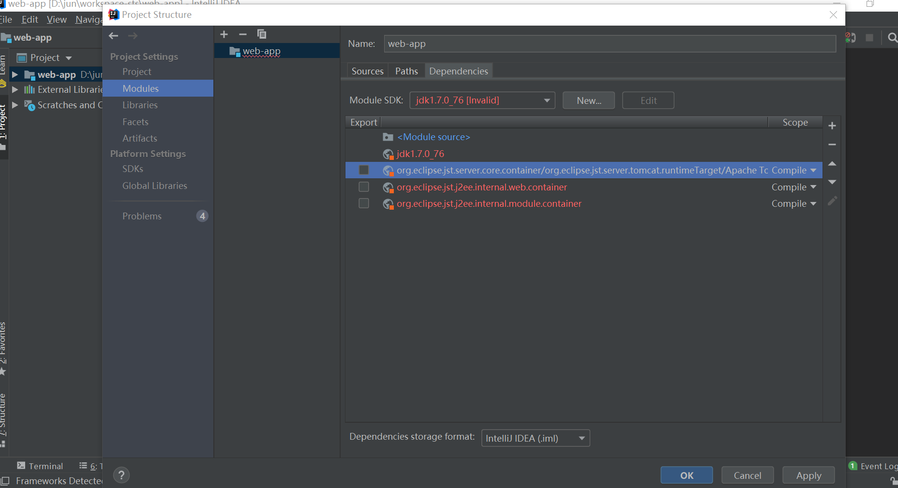
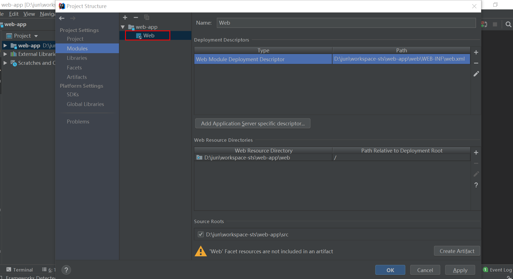
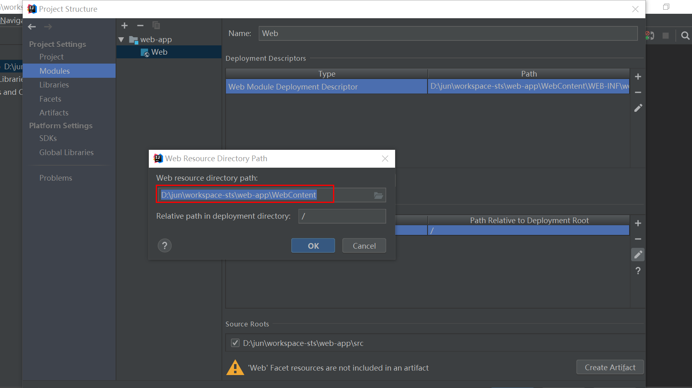
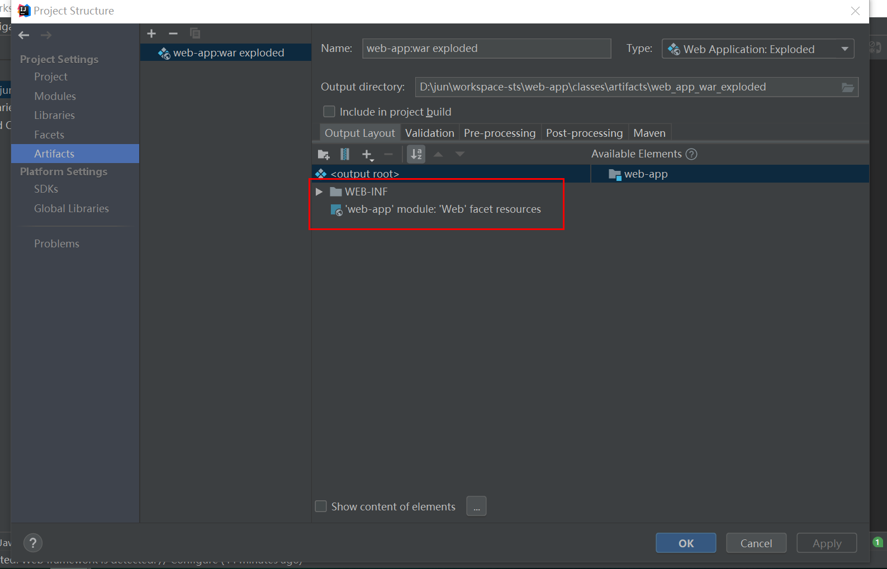

# idea导入eclipse中的web项目

## 前言
本文介绍把eclipse中的web项目导入到Idea中，并且用tomcat启动。

## 第一步:把项目直接用idea打开。

## 第二步:配置project


这里配置的jdk是1.7。

## 第三步:配置modules

- 选择Dependencies选项卡，去掉关于eclipse的相关内容，idea用红色提示了。



- 重新配置jdk，选择与project中相同的jdk版本。

- 导入jar包。正常情况下lib下。这里测试只有一个jar包。如果有用到tomcat下的jar包，也需要导入。


::: tip 提示
一个module就是一个子项目，idea中一般一个project就一个module，但也可以使一个project中有多个module。
::: 

- web配置

    由于这是一个web项目，所有module中还需要配置web。
具体操作：选中module名，右键，点击add，选择web。



    编辑Deployment Descriptors, 选中项目的web.xml文件。
    


    编辑Web Resource Directioes，选中项目的WebContent目录。这是eclipse中web项目的目录。




    下面的黄色提示可以不管，下一步解决。

## 第四步: 配置Artifacts

点击加号，选择Web Application:Exploaded，选择from module，选中上一步的Module。




回到module页面发现第三步中的黄色提示已经不见了。

## 第五步: 配置tomcat

依次如下操作：点击Run->Edit Configuration->点击Template->选择tomcat Server->点击local。这主要是配置tomcat。


选择Deployment标签，点击+号，选择Artifact，配置Application context。


::: tip 提示
新版的idea的application不在右侧，而是在最下面，鼠标一直往下滑动就可以看到。这是一个比较大的坑，很容易看不到而不去配置。这会导致访问不到。
::: 


## 第六步：启动、访问

启动，如果出现下面这种提示就表示成功了。

``` sh
Connected to server
[2019-03-28 05:37:38,199] Artifact web-app:war exploded: Artifact is being deployed, please wait...
28-Mar-2019 17:37:38.747 信息 [RMI TCP Connection(2)-127.0.0.1] org.apache.jasper.servlet.TldScanner.scanJars At least one JAR was scanned for TLDs yet contained no TLDs. Enable debug logging for this logger for a complete list of JARs that were scanned but no TLDs were found in them. Skipping unneeded JARs during scanning can improve startup time and JSP compilation time.
[2019-03-28 05:37:38,810] Artifact web-app:war exploded: Artifact is deployed successfully
[2019-03-28 05:37:38,810] Artifact web-app:war exploded: Deploy took 611 milliseconds
```
访问：


<Valine/>